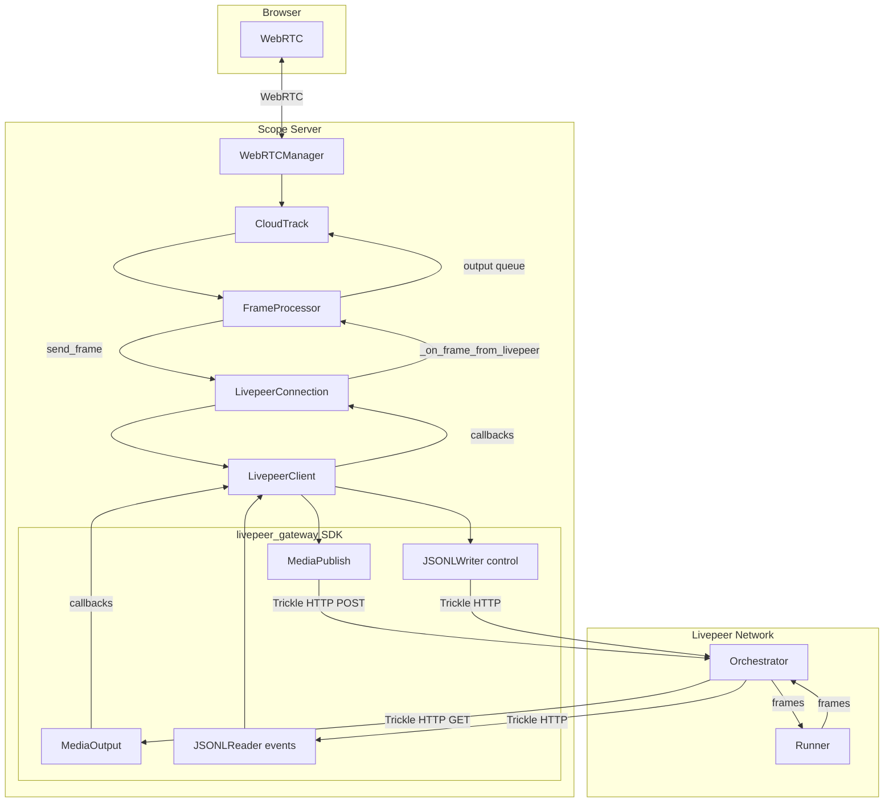
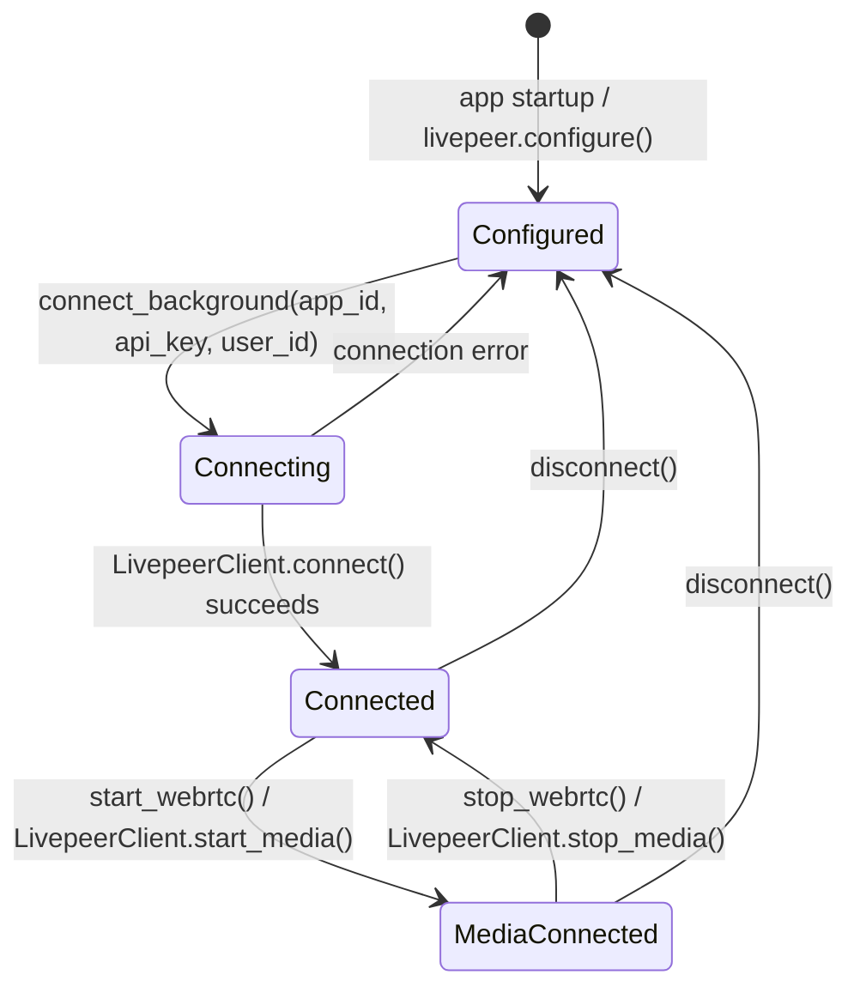
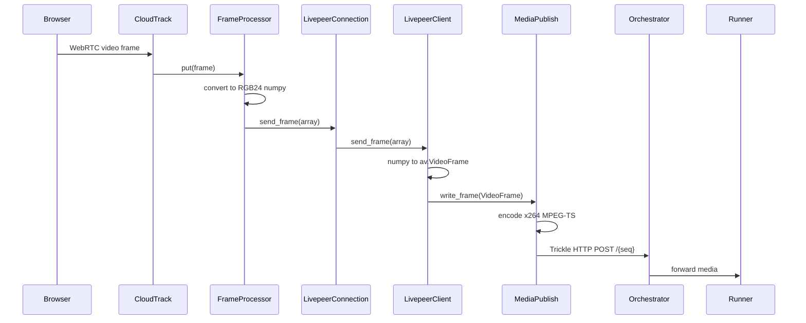
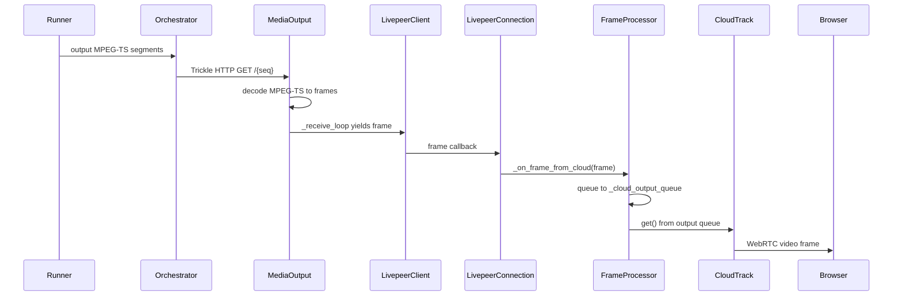
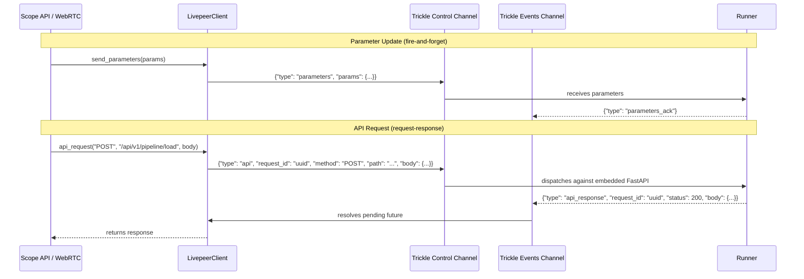

# Livepeer Client Architecture

This document describes how the Scope server integrates with the Livepeer network as an LV2V client. For the runner-side protocol and control messages, see [livepeer.md](livepeer.md). For setup instructions, see [How to Start Livepeer Mode](../livepeer.md).

## Overview

Scope supports two cloud backend modes, selectable via `SCOPE_CLOUD_MODE`:

- **Cloud relay** (default) — `CloudConnectionManager` connects to fal.ai over WebSocket + WebRTC
- **Livepeer** (`SCOPE_CLOUD_MODE=livepeer`) — `LivepeerConnection` creates an LV2V job and streams frames over trickle HTTP channels

Both implement the same interface (`send_frame`, `send_parameters`, `api_request`, frame/audio callbacks) behind a `ScopeCloudBackend` union type, so the rest of the server (FrameProcessor, CloudTrack, WebRTC handler) is mode-agnostic.

## Component Diagram



### Key Files

| File | Class/Role |
|------|------------|
| `server/livepeer.py` | `LivepeerConnection` — high-level connection manager |
| `server/livepeer_client.py` | `LivepeerClient` — transport layer, manages LV2V job lifecycle |
| `server/cloud_track.py` | `CloudTrack` — WebRTC media track bridging browser and cloud |
| `server/frame_processor.py` | `FrameProcessor` — routes frames to/from cloud backend |
| `server/webrtc.py` | `WebRTCManager.handle_offer_with_relay()` — sets up cloud WebRTC session |
| `server/scope_cloud_types.py` | `ScopeCloudBackend` — union type for both backends |
| `server/app.py` | Lifespan init, `get_scope_cloud()` dependency injection |

## Connection Lifecycle



### Startup Sequence

1. **App lifespan** (`app.py`) instantiates both `CloudConnectionManager` and `LivepeerConnection`
2. If `SCOPE_CLOUD_MODE=livepeer`, calls `livepeer.configure()` to mark backend available
3. `get_scope_cloud()` dependency returns the active backend based on env var

### Connection Sequence

1. **`connect_background(app_id, api_key, user_id)`** — spawns async task
2. Reads `LIVEPEER_TOKEN` from env (default: `"e30K"` = empty JSON `{}`)
3. Creates `LivepeerClient(token, model_id="scope", app_id=app_id)`
4. `LivepeerClient.connect()`:
   - Resolves orchestrator via `LIVEPEER_ORCH_URL` env or token-based discovery
   - Calls `start_lv2v()` in a thread — sends POST to orchestrator's `/live-video-to-video`
   - Receives job with `control_url`, `events_url`, `publish_url`, `subscribe_url`
   - Starts `_events_loop` (reads events channel) and `_ping_loop` (10s keepalive)
5. Registers frame/audio callbacks on the client

### Media Startup

When the browser starts streaming (first WebRTC frame):

1. `CloudTrack._start()` calls `cloud_manager.start_webrtc(initial_parameters)`
2. `LivepeerClient.start_media()`:
   - Sends `{"type": "start_stream", "params": ...}` on control channel
   - Waits for `stream_started` response with trickle channel URLs (10s timeout)
   - Creates `MediaPublish` (input) and `MediaOutput` (output)
   - Spawns `_receive_loop` to decode and dispatch output frames

## Frame Flow

### Input: Browser to Runner



### Output: Runner to Browser



### Control: Parameters and API Requests



## Backend Abstraction

Both cloud backends are interchangeable via the `ScopeCloudBackend` type:

```python
# scope_cloud_types.py
type ScopeCloudBackend = CloudConnectionManager | LivepeerConnection
```

The `get_scope_cloud()` FastAPI dependency returns the active backend:

```python
def get_scope_cloud() -> ScopeCloudBackend:
    if is_livepeer_enabled():
        return livepeer
    return cloud_connection_manager
```

Both backends implement the same interface used by `FrameProcessor` and `CloudTrack`:

| Method | Purpose |
|--------|---------|
| `send_frame(frame)` | Send input frame to cloud |
| `send_parameters(params)` | Update pipeline parameters |
| `api_request(method, path, body)` | Proxy API call to runner |
| `add_frame_callback(cb)` | Register output frame handler |
| `add_audio_callback(cb)` | Register output audio handler |
| `start_webrtc(params)` | Start media channels |
| `stop_webrtc()` | Stop media channels |
| `connect_background(...)` | Async connection |
| `disconnect()` | Tear down |
| `is_connected` | Connection state |
| `webrtc_connected` | Media channel state |
| `get_status()` | Status dict for API |

## Cloud Relay vs Livepeer Comparison

| Aspect | Cloud Relay | Livepeer |
|--------|-------------|----------|
| **Env var** | `SCOPE_CLOUD_MODE` unset or non-`livepeer` | `SCOPE_CLOUD_MODE=livepeer` |
| **Connection** | WebSocket to `wss://fal.run/<app_id>/ws` | LV2V job via `start_lv2v()` to orchestrator |
| **Media transport** | WebRTC peer connection | Trickle HTTP (MPEG-TS segments) |
| **Media encoding** | Raw WebRTC video tracks | x264-encoded MPEG-TS via `MediaPublish` |
| **Control channel** | JSON messages on same WebSocket | Separate trickle JSONL channel |
| **Events channel** | Responses on same WebSocket | Separate trickle JSONL channel |
| **Auth** | API key in WebSocket URL | `LIVEPEER_TOKEN` (base64 JSON) |
| **Discovery** | Direct fal.ai URL | Token signer/discovery or `LIVEPEER_ORCH_URL` |
| **API proxying** | JSON-RPC over WebSocket | Control message with request/response correlation |
| **Keepalive** | WebSocket ping/pong | Application-level ping every 10s |
| **Log forwarding** | `{"type": "logs"}` messages | Runner logs re-emitted on events channel |

## Error Handling and Shutdown

### Connection Errors

- `connect_background()` stores errors in `_connect_error`, accessible via `get_status()`
- Failed connections call `client.disconnect()` for cleanup before re-raising

### Graceful Shutdown

`LivepeerClient._shutdown()` tears down in order:
1. Close media handles (publisher, output, subscriber task)
2. Drain or cancel event/ping loop tasks (0.25s drain, then 5s cancel timeout)
3. Fail all pending API request futures
4. Close control writer and job

### Timeouts

| Operation | Timeout |
|-----------|---------|
| `start_media()` waiting for `stream_started` | 10s |
| `api_request()` default | 30s |
| `disconnect()` client shutdown | 15s |
| Drain tasks before cancel | 0.25s |
| Cancel task wait | 5s |

## Environment Variables

See the [environment variables table](../livepeer.md#environment-variables) in the setup guide for the full reference.
