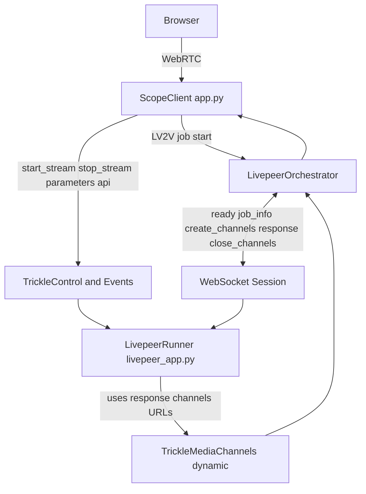
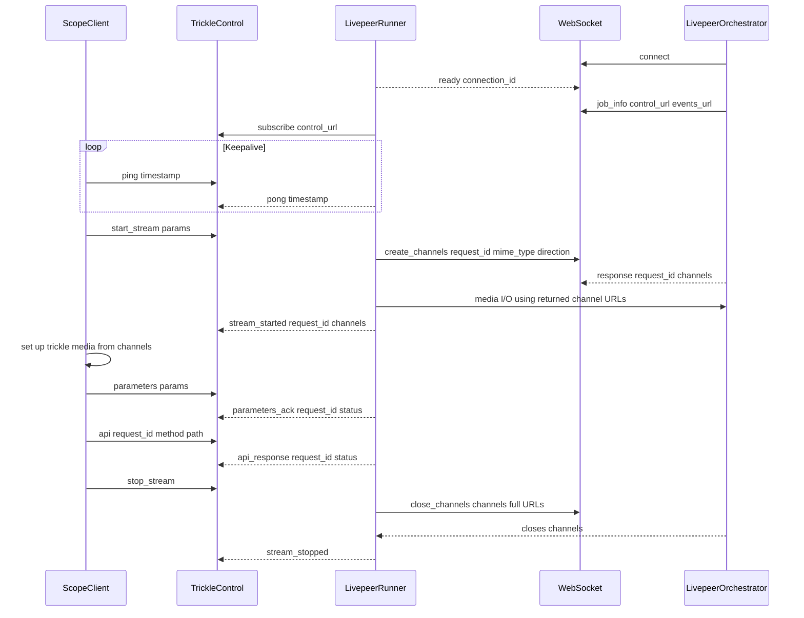

# Livepeer Mode

Scope can route inference through the [Livepeer](https://livepeer.org) network instead of running locally.

> **Dependency note:** Running either the Scope server in Livepeer cloud mode or the standalone runner requires the `livepeer` extra, which pulls in `uvicorn[standard]`:
>
> ```bash
> uv sync --extra livepeer
> ```

## Quick Start

1. Install the `livepeer` extra (if you haven't already):

```bash
uv sync --extra livepeer
```

2. Start the Livepeer runner somewhere reachable by the orchestrator:

```bash
uv run python -m scope.cloud.livepeer_app --host 0.0.0.0 --port 8001
```

3. Start Scope in Livepeer mode:

```bash
SCOPE_CLOUD_MODE=livepeer \
LIVEPEER_TOKEN=<base64-json-token> \
LIVEPEER_WS_URL=ws://127.0.0.1:8001/ws \
uv run daydream-scope
```

4. Connect Scope to the remote backend from the UI, or by calling either:

- `POST /api/v1/cloud/connect`
- `POST /api/v1/livepeer/connect`

Both endpoints accept the normal `CloudConnectRequest` body, but in Livepeer mode
the request credentials are currently ignored and the server uses
`LIVEPEER_TOKEN` from the environment instead.

5. Start streaming from the Scope UI. Scope creates the Livepeer LV2V (live-video-
to-video) job on connect, then opens media channels when the stream starts.

## Architecture



- The **Scope client** (`app.py`) acts as the LV2V client. It calls `start_lv2v()`, sends control messages (`start_stream`, `stop_stream`, `parameters`, `api`) over trickle channels, and relays browser media.
- The **runner** (`livepeer_app.py`) acts as the WebSocket and trickle counterpart. It receives job info over WebSocket, subscribes to control and events channels, requests stream media channels over WebSocket, then consumes frames from the `in` channel and publishes processed frames to the `out` channel.
- The **orchestrator** creates and closes trickle media channels in response to WebSocket stream lifecycle messages.

## Running the Scope Server in Livepeer Mode

Set the following environment variables before starting the server:

| Variable             | Description |
| -------------------- | ----------- |
| `SCOPE_CLOUD_MODE`   | Set to `livepeer` to enable Livepeer relay mode. |
| `LIVEPEER_TOKEN`     | Required. Base64-encoded JSON token used to start the LV2V job. |
| `LIVEPEER_ORCH_URL`  | Optional explicit orchestrator URL. Accepted formats: `host[:port]` or `http(s)://host[:port]` (for example `orchestrator.example.com:8935`). If unset, token discovery is used. |
| `LIVEPEER_WS_URL`    | Optional explicit runner WebSocket URL passed as `ws_url` (for example `ws://127.0.0.1:8001/ws` or `wss://fal.run/<app-id>/ws`). |
| `SCOPE_CLOUD_APP_ID` | Optional fal app id used to construct `ws_url` as `wss://fal.run/<app-id>`. Must include `/ws` suffix (for example `daydream/scope-livepeer-runner/ws`). Used when `LIVEPEER_WS_URL` is not set. |
| `LIVEPEER_DEBUG`     | Set to any value to enable debug logging for the Livepeer Gateway SDK and local Livepeer modules. |

```bash
SCOPE_CLOUD_MODE=livepeer LIVEPEER_TOKEN=<token> uv run daydream-scope
```

Important behavior:

- `SCOPE_CLOUD_MODE=livepeer` switches the cloud backend implementation to Livepeer.
- A Livepeer job is created when Scope connects to the cloud backend, not when the process boots.
- Media channels are created later, when the stream starts.
- `POST /api/v1/cloud/connect` and `POST /api/v1/livepeer/connect` both work in this mode.
- `POST /api/v1/cloud/disconnect` and `POST /api/v1/livepeer/disconnect` both stop the active Livepeer connection.
- `GET /api/v1/cloud/status` reports the active backend status. Livepeer-specific status is also available at `GET /api/v1/livepeer/status`.

## Running the Runner (`livepeer_app.py`)

The runner is a standalone FastAPI WebSocket server that sits on the other end of the trickle channels. It receives the LV2V job response forwarded by the orchestrator, subscribes to the control channel, processes frames in-process using Scope's `FrameProcessor`, and proxies API requests into the embedded Scope FastAPI app.

Make sure the `livepeer` extra is installed first:

```bash
uv sync --extra livepeer
```

Then start the runner:

```bash
uv run python -m scope.cloud.livepeer_app
```

Set `LIVEPEER_DEBUG=1` when running the runner to enable DEBUG logs for `livepeer_gateway` and `scope.cloud.livepeer_app`.

Runner-specific environment variables:

| Variable             | Description |
| -------------------- | ----------- |
| `LIVEPEER_DEBUG`     | Enables verbose runner and gateway logging. |
| `DAYDREAM_API_BASE`  | Optional override for the Daydream API base used when validating remote plugin installs. Defaults to `https://api.daydream.live`. |

Options:

```
--host   Host to bind to  (default: 0.0.0.0)
--port   Port to bind to  (default: 8001)
--reload Enable auto-reload for development
```

## Running the runner on Fal

The canonical Livepeer runner implementation remains `scope.cloud.livepeer_app`.
For Fal deployment, use `scope.cloud.livepeer_fal_app` as a thin wrapper that:

- starts `scope.cloud.livepeer_app` in the container
- proxies Fal `/ws` traffic to the local runner `/ws`

Deploy the Livepeer wrapper app:

```bash
fal deploy --env main --auth public src/scope/cloud/livepeer_fal_app.py
```

Then point Scope's Livepeer mode at the Fal-hosted runner URL:

```bash
SCOPE_CLOUD_MODE=livepeer \
LIVEPEER_TOKEN=<base64-json-token> \
SCOPE_CLOUD_APP_ID=<app-id>/ws \
uv run daydream-scope
```

Equivalent explicit URL form:

```bash
SCOPE_CLOUD_MODE=livepeer \
LIVEPEER_TOKEN=<base64-json-token> \
LIVEPEER_WS_URL=wss://fal.run/<app-id>/ws \
uv run daydream-scope
```

To switch away from explicit runner overrides, unset both `LIVEPEER_WS_URL` and `SCOPE_CLOUD_APP_ID`. In that case, the runner URL uses the default Livepeer flow.

The Livepeer orchestrator must be able to reach whichever runner endpoint is resolved.

### WebSocket Protocol

In normal operation, the orchestrator connects to `ws://<host>:<port>/ws`. The runner immediately replies with a ready message, then expects a single JSON message containing the LV2V job response shape.

Ready message sent by the runner:

```json
{
  "type": "ready",
  "connection_id": "abcd1234"
}
```

Job info message expected by the runner:

```json
{
  "manifest_id": "...",
  "control_url": "https://orchestrator/control/...",
  "events_url": "https://orchestrator/events/..."
}
```

After job info arrives, the runner subscribes to `control_url` and starts handling control messages.

The orchestrator sends protocol-level websocket pings; the runner responds with protocol-level pongs automatically via the websocket server implementation.

#### Stream lifecycle messages over WebSocket

The websocket application protocol uses three message categories:

- Request: domain `type` plus `request_id`
- Response: `{"type":"response","request_id":"..."}` plus payload fields
- Notification: domain `type` with no `request_id`

When the runner receives control-channel `start_stream`, it sends:

```json
{
  "type": "create_channels",
  "request_id": "<uuid>",
  "mime_type": "video/MP2T",
  "direction": "bidirectional"
}
```

The orchestrator responds:

```json
{
  "type": "response",
  "request_id": "<uuid>",
  "channels": [
    {
      "url": "https://.../ai/trickle/<channel-in>",
      "direction": "in",
      "mime_type": "video/MP2T"
    },
    {
      "url": "https://.../ai/trickle/<channel-out>",
      "direction": "out",
      "mime_type": "video/MP2T"
    }
  ]
}
```

When the runner stops a stream, it sends websocket `close_channels` with full channel URLs:

```json
{
  "type": "close_channels",
  "channels": [
    "https://.../ai/trickle/<channel-in>",
    "https://.../ai/trickle/<channel-out>"
  ]
}
```

### Control Messages

Control messages arrive as JSON objects. The Scope client currently sends:

| `type`          | Fields                                         | Purpose |
| --------------- | ---------------------------------------------- | ------- |
| `start_stream`  | `request_id`, `params: dict`                   | Stream is starting; initial params |
| `stop_stream`   | `request_id` optional                          | Stream is stopping |
| `parameters`    | `params: dict`                                 | Real-time parameter update |
| `api`           | `request_id`, `method`, `path`, `body?: dict`  | Proxied API request to the runner |
| `ping`          | `timestamp`, `request_id` optional             | Keepalive sent by the Scope server |

Notes:

- `start_stream` requires at least one loaded pipeline. If `params.pipeline_ids` is omitted, the runner falls back to the currently loaded pipeline IDs.
- `parameters` returns `{"type":"parameters_ack","request_id":"...","status":"ok"}` on success.
- `api` requests are dispatched in-process against the embedded Scope FastAPI app.
- Remote plugin installs requested through `POST /api/v1/plugins` are validated against the Daydream allow list before the runner forwards them.

When `start_stream` succeeds, the runner sends a `stream_started` response on the events channel with the created trickle channel URLs:

```json
{
  "type": "stream_started",
  "request_id": "<uuid>",
  "channels": [
    {
      "url": "https://.../ai/trickle/<channel-in>",
      "direction": "in",
      "mime_type": "video/MP2T"
    },
    {
      "url": "https://.../ai/trickle/<channel-out>",
      "direction": "out",
      "mime_type": "video/MP2T"
    }
  ]
}
```

The control events channel can also emit:

- `stream_stopped` after a successful stop
- `api_response` after a proxied API call
- `parameters_ack` after a successful parameter update
- `error` when a request fails validation or runner-side setup fails
- `pong` in response to keepalive `ping` control messages

Direction semantics:

- `in`: client publishes frames to this URL.
- `out`: client subscribes and receives frames from this URL.

These directions are defined from the **Scope client** perspective. Therefore, on the runner side, the data flow is intentionally the inverse operation:

- runner reads and subscribes from `in`
- runner writes and publishes to `out`

## End-to-end flow


