# Daydream Scope - Technical Documentation

## Table of Contents

1. [Project Overview](#project-overview)
2. [Architecture](#architecture)
3. [Directory Structure](#directory-structure)
4. [Logical Layers](#logical-layers)
5. [Core Components](#core-components)
6. [Data Flow](#data-flow)
7. [Key Patterns](#key-patterns)
8. [Pipeline Architecture](#pipeline-architecture)
9. [WebRTC Streaming](#webrtc-streaming)
10. [Desktop Application](#desktop-application)
11. [Additional Topics](#additional-topics)
12. [Summary](#summary)

---

## 1. Project Overview

Daydream Scope is a real-time, interactive generative AI video platform that combines:

- **Python Backend**: FastAPI server with ML pipeline management
- **Frontend**: React/TypeScript web interface
- **Desktop App**: Electron wrapper bundling backend and frontend
- **ML Pipelines**: Multiple autoregressive video diffusion models

The system enables real-time video generation and processing through WebRTC streaming, with support for various AI models including LongLive, MemFlow, StreamDiffusionV2, and others.

---

## 2. Architecture

### 2.1. High-Level Architecture

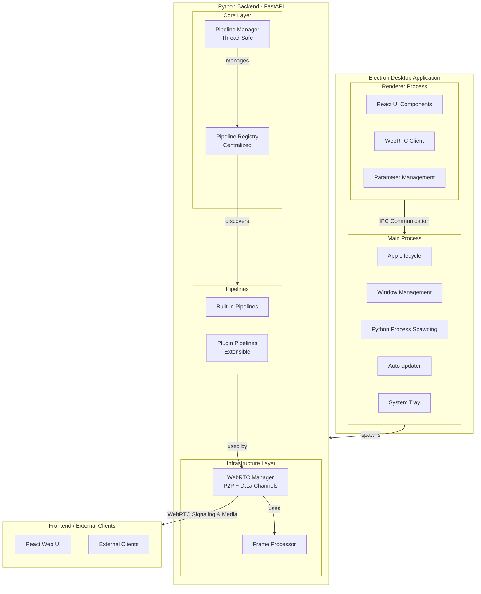

### 2.2. Layered Architecture

The system follows a clear separation of concerns:

1. **Presentation Layer**: React frontend with hooks-based state management
2. **Application Layer**: FastAPI providing REST API + WebRTC signaling
3. **Domain Layer**: Pipeline interfaces, schemas, and business logic
4. **Infrastructure Layer**: WebRTC streaming, frame processing, hardware abstraction

---

## 3. Directory Structure

```
scope/
├── app/                          # Electron desktop application
│   ├── src/
│   │   ├── components/           # Electron-specific UI components
│   │   │   ├── Setup.tsx       # Initial setup wizard
│   │   │   ├── ServerLoading.tsx
│   │   │   └── ErrorBoundary.tsx
│   │   ├── main.ts              # Main process entry point
│   │   ├── preload.ts           # Context bridge (IPC)
│   │   ├── renderer.tsx         # Renderer entry
│   │   ├── services/
│   │   │   ├── setup.ts         # uv installation, sync
│   │   │   ├── pythonProcess.ts  # Python process spawning
│   │   │   └── electronApp.ts   # Window management
│   │   ├── types/              # TypeScript type definitions
│   │   └── utils/
│   │       ├── config.ts         # Configuration validation
│   │       ├── logger.ts        # Electron logging
│   │       └── port.ts          # Port management
│   ├── package.json
│   └── vite.*.config.ts       # Electron-specific Vite configs
│
├── frontend/                     # React web application
│   ├── src/
│   │   ├── components/          # React UI components
│   │   │   ├── ui/             # Shadcn/ui components
│   │   │   ├── VideoOutput.tsx
│   │   │   ├── PromptInput.tsx
│   │   │   ├── PromptTimeline.tsx
│   │   │   ├── TimelinePromptEditor.tsx
│   │   │   ├── LoRAManager.tsx
│   │   │   ├── SettingsPanel.tsx
│   │   │   ├── MediaPicker.tsx
│   │   │   ├── Header.tsx
│   │   │   └── StatusBar.tsx
│   │   ├── hooks/              # Custom React hooks
│   │   │   ├── useWebRTC.ts
│   │   │   ├── usePipeline.ts
│   │   │   ├── usePipelines.ts
│   │   │   ├── usePromptManager.ts
│   │   │   ├── useTimelinePlayback.ts
│   │   │   ├── useStreamState.ts
│   │   │   ├── useLocalVideo.ts
│   │   │   └── useVideoSource.ts
│   │   ├── lib/
│   │   │   ├── api.ts          # API client functions
│   │   │   └── utils.ts
│   │   ├── types/
│   │   │   └── index.ts        # TypeScript interfaces
│   │   ├── data/
│   │   │   ├── pipelines.ts     # Pipeline metadata
│   │   │   └── parameterMetadata.ts
│   │   └── App.tsx
│   ├── package.json
│   └── vite.config.ts
│
├── src/scope/                    # Python backend package
│   ├── __init__.py
│   ├── core/                     # Core domain logic
│   │   ├── __init__.py
│   │   ├── config.py
│   │   ├── pipelines/
│   │   │   ├── interface.py           # Abstract Pipeline base
│   │   │   ├── registry.py            # Pipeline registry
│   │   │   ├── base_schema.py        # Pydantic base configs
│   │   │   ├── artifacts.py           # Model artifact definitions
│   │   │   ├── components.py         # Component manager
│   │   │   ├── process.py            # Post-processing utilities
│   │   │   ├── defaults.py           # Mode defaults helper
│   │   │   ├── blending.py           # Prompt blending
│   │   │   ├── memory.py             # Memory bank utilities
│   │   │   ├── common_artifacts.py   # Shared artifact paths
│   │   │   │
│   │   │   ├── longlive/             # LongLive pipeline
│   │   │   │   ├── pipeline.py
│   │   │   │   ├── schema.py
│   │   │   │   ├── modules/           # Model components
│   │   │   │   │   ├── model.py
│   │   │   │   │   ├── causal_model.py
│   │   │   │   │   ├── vae.py
│   │   │   │   │   └── __init__.py
│   │   │   │   ├── modular_blocks.py
│   │   │   │   ├── components/        # VAE components
│   │   │   │   └── blocks/
│   │   │   │       └── setup_memory_bank.py
│   │   │   ├── memflow/             # MemFlow pipeline
│   │   │   ├── streamdiffusionv2/    # StreamDiffusion pipeline
│   │   │   ├── reward_forcing/      # Reward-Forcing pipeline
│   │   │   ├── video_depth_anything/ # Depth estimation pipeline
│   │   │   ├── passthrough/          # Debug/test pipeline
│   │   │   ├── krea_realtime_video/ # Krea pipeline
│   │   │   │
│   │   │   ├── wan2_1/              # Wan2.1 base components
│   │   │   │   ├── components.py      # Model wrappers
│   │   │   │   ├── lora/            # LoRA support
│   │   │   │   │   ├── mixin.py
│   │   │   │   │   └── strategies/      # LoRA strategies
│   │   │   │   ├── vace.py          # VACE conditioning
│   │   │   │   └── vae.py           # VAE factory
│   │   │   └── video.py              # Video utilities
│   │   │
│   │   └── plugins/               # Plugin system
│   │       ├── __init__.py
│   │       ├── manager.py            # Plugin manager
│   │       ├── hookspecs.py          # Plugin hooks
│   │       └── dependency_validator.py
│   │
│   └── server/                    # FastAPI application
│       ├── __init__.py
│       ├── app.py                 # Main FastAPI app
│       ├── pipeline_manager.py    # Pipeline lifecycle manager
│       ├── webrtc.py              # WebRTC implementation
│       ├── tracks.py              # Video track handling
│       ├── frame_processor.py     # Frame processing loop
│       ├── download_models.py     # Model download manager
│       ├── download_progress_manager.py
│       ├── models_config.py       # Model paths/directories
│       ├── artifact_registry.py
│       ├── logs_config.py        # Logging configuration
│       ├── credentials.py         # TURN credential management
│       ├── schema.py             # Pydantic API schemas
│       ├── build.py
│       └── spout/                # Spout integration (Windows)
│           ├── sender.py
│           ├── receiver.py
│           └── __init__.py
│
├── tests/                       # Python tests
├── docs/                        # Documentation
├── pyproject.toml                # Python package config
├── build.sh                     # Build script
├── publish.sh                   # Publish script
└── CLAUDE.md                    # Development instructions
```

---

## 4. Logical Layers

### 4.1. Presentation Layer

**Location**: `frontend/src/`, `app/src/`

**Responsibilities**:
- User interface rendering with React 19 + TypeScript
- State management via custom hooks
- WebRTC client connection management
- Timeline and prompt editing UI
- Parameter control panels

**Key Files**:
- `frontend/src/App.tsx` - Root component
- `frontend/src/pages/StreamPage.tsx` - Main streaming page
- `frontend/src/hooks/useWebRTC.ts` - WebRTC connection logic
- `frontend/src/hooks/usePipeline.ts` - Pipeline state management
- `frontend/src/lib/api.ts` - API client


### 4.2. Application Layer

**Location**: `src/scope/server/app.py`

**Responsibilities**:
- REST API endpoints for pipeline management
- WebRTC signaling server
- Model download and status checking
- Asset management (LoRA, images, videos)
- Health checks and hardware info

**Key Endpoints**:
- `GET /health` - Health check
- `POST /api/v1/pipeline/load` - Load pipeline
- `GET /api/v1/pipeline/status` - Get pipeline status
- `GET /api/v1/pipelines/schemas` - Get pipeline configs
- `POST /api/v1/webrtc/offer` - WebRTC offer/answer
- `PATCH /api/v1/webrtc/offer/{id}` - ICE candidates
- `POST /api/v1/models/download` - Download models


### 4.3. Domain Layer

**Location**: `src/scope/core/`

**Responsibilities**:
- Pipeline abstract interface and implementation
- Configuration schema definitions
- Artifact/dependency declarations
- Plugin registration and discovery
- Business logic for AI models

**Key Files**:
- `core/pipelines/interface.py` - Abstract Pipeline base
- `core/pipelines/registry.py` - Centralized pipeline registry
- `core/pipelines/base_schema.py` - Pydantic config schemas
- `core/pipelines/artifacts.py` - Model artifact definitions

### 4.4. Infrastructure Layer

**Location**: `src/scope/server/` (selected modules)

**Responsibilities**:
- WebRTC streaming with aiortc
- Frame processing and queuing
- Thread-safe pipeline access
- Hardware abstraction (CUDA/CPU)
- External integrations (Spout)

**Key Files**:
- `server/webrtc.py` - WebRTC peer connections
- `server/tracks.py` - MediaStreamTrack implementation
- `server/frame_processor.py` - Frame processing loop
- `server/pipeline_manager.py` - Thread-safe pipeline lifecycle

---

## 5. Core Components

### 5.1. Pipeline Manager

**File**: `src/scope/server/pipeline_manager.py`

**Purpose**: Thread-safe lifecycle management for ML pipelines

**Key Features**:
- **Lazy Loading**: Pipelines load on-demand via `load_pipeline()`
- **Thread Safety**: Reentrant locks protect all pipeline access
- **State Machine**: NOT_LOADED → LOADING → LOADED / ERROR
- **Parameter Validation**: Checks params before loading to avoid reloads
- **VRAM Management**: Automatically clears CUDA cache on unload

**Status Transitions**:

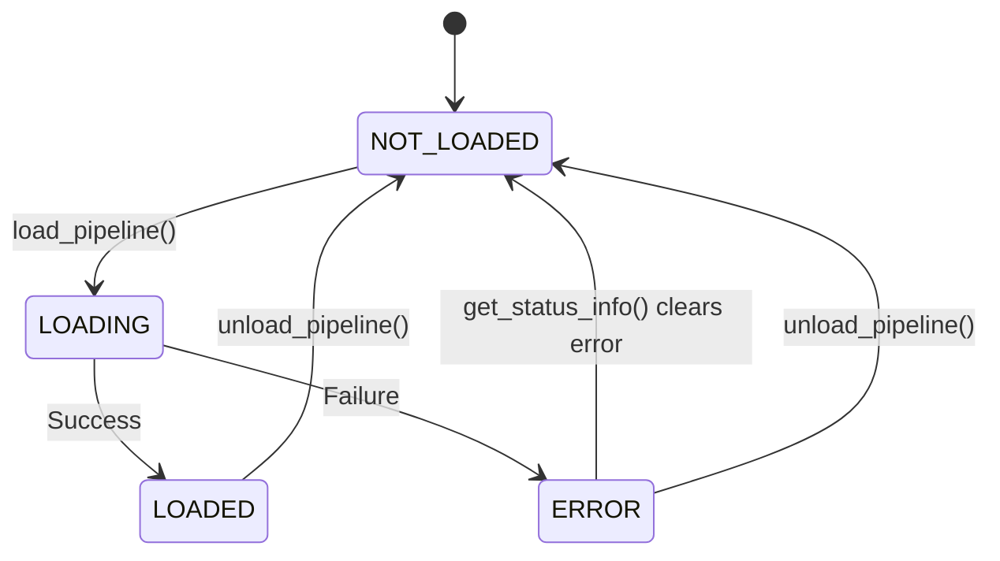

**Key Methods**:
- `load_pipeline(pipeline_id, load_params)` - Async load with params
- `get_pipeline()` - Thread-safe pipeline access (raises if not loaded)
- `get_status_info()` - Returns status, error, loaded_lora_adapters
- `unload_pipeline()` - Clear pipeline and GPU cache


### 5.2. Pipeline Registry

**File**: `src/scope/core/pipelines/registry.py`

**Purpose**: Centralized pipeline discovery and metadata access

**Key Features**:
- **Eliminates If/Else Chains**: Dynamic lookup by pipeline_id
- **VRAM Filtering**: Only registers pipelines that meet GPU requirements
- **Plugin Support**: Extensible via entry points
- **Metadata Access**: Config classes, schemas, capabilities

### 5.3. WebRTC Manager

**File**: `src/scope/server/webrtc.py`

**Purpose**: Manages WebRTC peer connections for video streaming

**Key Features**:
- **Session Management**: Multiple concurrent connections supported
- **Trickle ICE**: ICE candidates sent as they're discovered
- **Data Channels**: Real-time parameter updates
- **TURN Support**: Configurable via Twilio/HuggingFace tokens

**Connection Flow**:

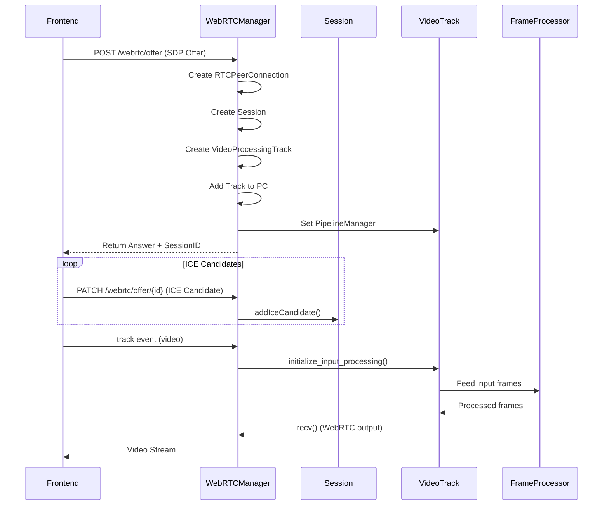

**Session Lifecycle**:
1. Offer received → Create `RTCPeerConnection` + `Session`
2. Add `VideoProcessingTrack` as outbound track
3. Set remote description (offer)
4. Create answer → Set local description
5. ICE candidates trickle in
6. On "track" event → Initialize input processing
7. On connection close → Cleanup session and track

### 5.4. Frame Processor

**File**: `src/scope/server/frame_processor.py`

**Purpose**: Background processing loop that feeds frames to pipeline

**Key Features**:
- **Worker Thread**: Dedicated thread for ML inference
- **Frame Buffering**: Deque with max size for input frames
- **Output Queuing**: Separate queue for processed output frames
- **Parameter Updates**: Queue for runtime parameter changes
- **FPS Calculation**: Dynamic FPS tracking for rate limiting
- **Spout Integration**: Windows-only Spout sender/receiver

**Processing Loop**:

```mermaid
flowchart TD
    direction TB
    
    subgraph WorkerLoop["Worker Thread Loop"]
        
        subgraph CheckParams["1. Check for Parameter Updates"]
            CP1[Pop from parameters_queue]
            CP2[Apply new parameters to state]
            CP3[Handle Spout config changes]
        end
        
        subgraph Prepare["2. Prepare Pipeline"]
            PR1[Call pipeline.prepare]
            PR2[Get input requirements]
        end
        
        subgraph Sample["3. Sample Input Frames"]
            SA1[Check frame_buffer]
            SA2[Uniform sampling from buffer]
            SA3[Remove processed frames]
        end
        
        subgraph Infer["4. Run Pipeline Inference"]
            IN1[Call pipeline with params]
            IN2[Generate output tensor]
        end
        
        subgraph Output["5. Process Output"]
            OU1[Normalize to 0-255 uint8]
            OU2[Enqueue to output_queue]
            OU3[Enqueue to Spout queue]
        end
        
        subgraph FPS["6. Calculate FPS"]
            FP1[Measure processing time]
            FP2[Calculate frames per second]
            FP3[Update output FPS]
        end
        
        CheckParams --> Prepare --> Sample --> Infer --> Output --> FPS
    end
```

**Input Sampling Algorithm**:
- Frames are sampled **uniformly** from the buffer to maintain temporal coverage
- Example: 8 frames in buffer, need 4 → indices [0, 2, 4, 6]
- Processed frames are **removed** from buffer to prevent buildup

### 5.5. Video Track

**File**: `src/scope/server/tracks.py`

**Purpose**: `MediaStreamTrack` implementation for WebRTC output

**Key Features**:
- **Frame Rate Control**: `next_timestamp()` controls output FPS
- **Pause Support**: Returns last frame when paused
- **FPS Adaptation**: Adjusts to pipeline performance

**Flow**:

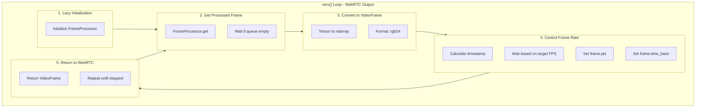

---

## 6. Data Flow

### 6.1. Stream Initialization Flow

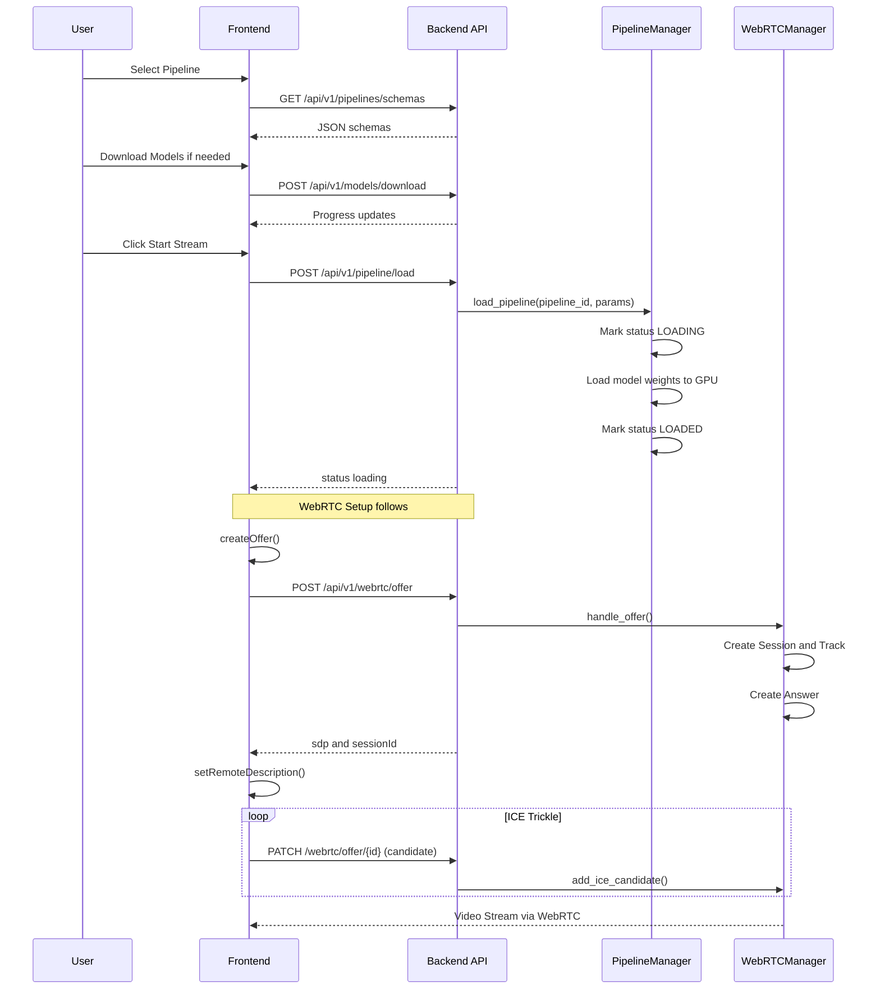

### 6.2. Runtime Parameter Update Flow

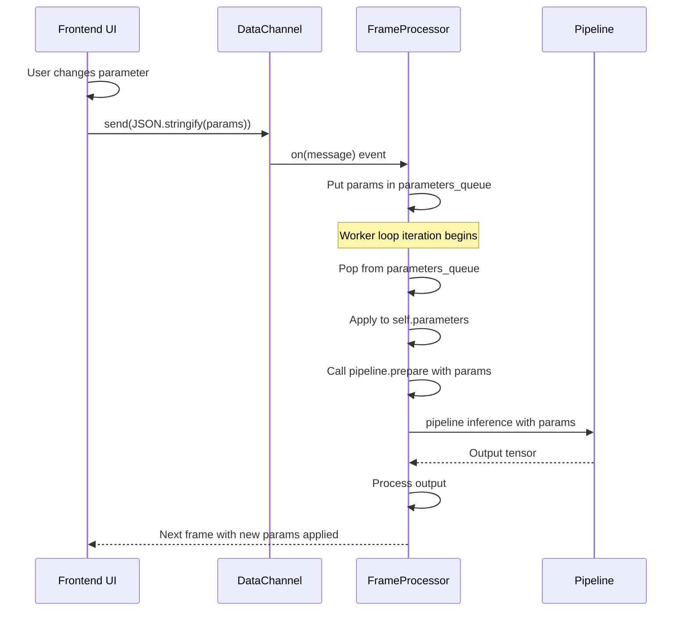

### 6.3. Frame Processing Flow

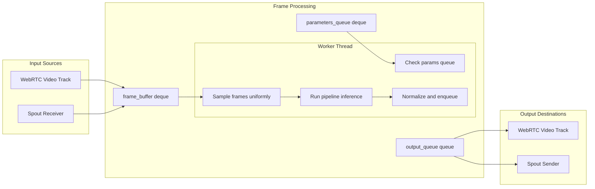

---

## 7. Key Patterns

### 7.1. Pipeline Interface Pattern

**Purpose**: Abstract contract for all AI pipelines

**Definition** (`core/pipelines/interface.py`):
```python
class Pipeline(ABC):
    @classmethod
    def get_config_class(cls) -> type[BasePipelineConfig]:
        """Return Pydantic config class"""
        pass

    @abstractmethod
    def __call__(
        self,
        input: torch.Tensor | list[torch.Tensor] | None = None,
        **kwargs
    ) -> torch.Tensor:
        """Process video chunk, return output tensor"""
        pass
```

**Usage**: All pipelines implement this interface, allowing generic handling.

### 7.2. Registry Pattern

**Purpose**: Centralized lookup eliminating conditional chains

**Implementation** (`core/pipelines/registry.py`):
```python
class PipelineRegistry:
    _pipelines: dict[str, type[Pipeline]] = {}

    @classmethod
    def register(cls, pipeline_id: str, pipeline_class: type[Pipeline]):
        cls._pipelines[pipeline_id] = pipeline_class

    @classmethod
    def get(cls, pipeline_id: str) -> type[Pipeline] | None:
        return cls._pipelines.get(pipeline_id)
```

**Benefits**:
- No if/elif chains for pipeline selection
- Dynamic discovery at runtime
- Easy plugin integration

### 7.3. Thread-Safe State Pattern

**Purpose**: Protect shared state with reentrant locks

**Implementation** (`server/pipeline_manager.py`):
```python
class PipelineManager:
    def __init__(self):
        self._lock = threading.RLock()  # Single reentrant lock

    def get_pipeline(self):
        with self._lock:
            if self._status != PipelineStatus.LOADED:
                raise PipelineNotAvailableException()
            return self._pipeline
```

**Key Points**:
- Reentrant lock allows same thread to re-enter
- All state access protected by lock
- Status checks must be atomic with access

### 7.4. Component Manager Pattern

**Purpose**: Provide attribute-style access to dynamic components

**Implementation** (`core/pipelines/components.py`):
```python
class ComponentsManager:
    def __init__(self, config: dict):
        self._components = {}

    def add(self, name: str, component):
        self._components[name] = component

    def __getattr__(self, name):
        return self._components[name]  # Raises AttributeError if not found
```

**Usage in Pipelines**:
```python
self.components = ComponentsManager(config)
self.components.add("generator", generator)
self.components.add("vae", vae)
self.components.add("text_encoder", text_encoder)

# Access like attributes
output = self.blocks(self.components, self.state)
# In blocks: self.components.generator, self.components.vae, etc.
```

### 7.5. Schema-First Configuration Pattern

**Purpose**: Type-safe configuration with JSON Schema generation

**Implementation** (`core/pipelines/base_schema.py`):
```python
class BasePipelineConfig(BaseModel):
    # Class-level metadata
    pipeline_id: ClassVar[str] = "base"
    pipeline_name: ClassVar[str] = "Base Pipeline"
    supports_lora: ClassVar[bool] = False
    estimated_vram_gb: ClassVar[float | None] = None

    # Instance-level configuration
    height: int = height_field(512)
    width: int = width_field(512)
    denoising_steps: list[int] | None = None

    @classmethod
    def get_schema_with_metadata(cls) -> dict:
        """Returns complete schema for API/UI"""
        return {
            "id": cls.pipeline_id,
            "name": cls.pipeline_name,
            "config_schema": cls.model_json_schema(),
            # ... capabilities, etc.
        }
```

**Benefits**:
- Single source of truth for parameters
- Automatic validation via Pydantic
- JSON Schema for API/UI generation
- Mode-specific defaults support

### 7.6. Plugin Hook Pattern

**Purpose**: Extensible architecture via pluggy

**Implementation** (`core/plugins/manager.py`):
```python
import pluggy

pm = pluggy.PluginManager("scope")
pm.add_hookspecs(ScopeHookSpec)

def register_plugin_pipelines(registry):
    pm.hook.register_pipelines(register=callback)
```

**Hook Specification**:
```python
class ScopeHookSpec:
    def register_pipelines(register: callable):
        """Plugin must implement this to register pipelines"""
        pass
```

---

## 8. Pipeline Architecture

### 8.1. Pipeline Structure

Each pipeline follows this modular structure:

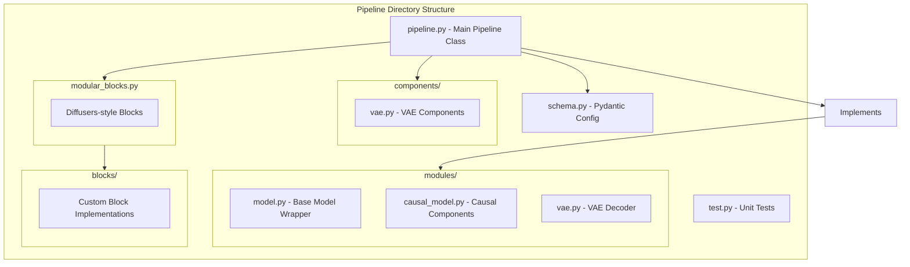

### 8.2. Base Pipeline Class

**Location**: `core/pipelines/interface.py`

**Key Contract**:
```python
class Pipeline(ABC):
    @classmethod
    def get_config_class(cls) -> type[BasePipelineConfig]:
        """Return Pydantic config class"""

    @abstractmethod
    def __call__(
        self,
        input: torch.Tensor | list[torch.Tensor] | None = None,
        **kwargs
    ) -> torch.Tensor:
        """
        Process a chunk of video frames.

        Args:
            input: BCTHW tensor OR list of THWC frames [0,255]
                   OR None (text-only mode)

        Returns:
            THWC tensor in [0,1] range
        """
```

### 8.3. Pipeline Config Schema

**Location**: `core/pipelines/base_schema.py`

**Hierarchy**:
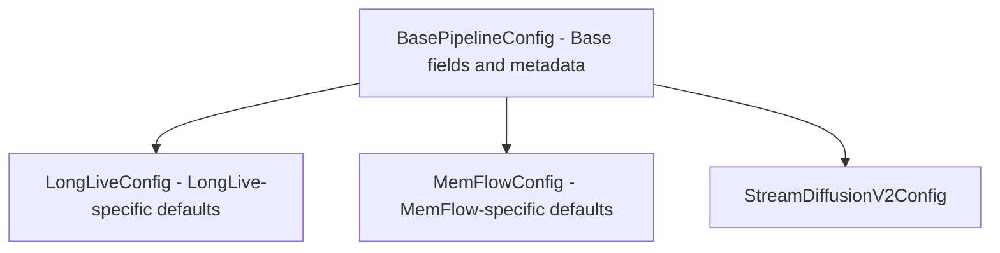

**Mode Support**:
```python
class BasePipelineConfig(BaseModel):
    modes: ClassVar[dict[str, ModeDefaults]] = {
        "text": ModeDefaults(default=True),
        "video": ModeDefaults(
            height=512,
            width=512,
            noise_scale=0.7,
            noise_controller=True,
        ),
    }
```

### 8.4. Example: LongLive Pipeline

**Location**: `core/pipelines/longlive/pipeline.py`

**Inheritance Chain**:
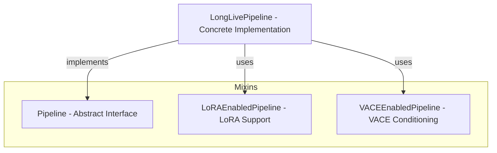

**Initialization Flow**:
```mermaid
flowchart TD
    direction TB
    
    subgraph LongLiveInit["LongLive Pipeline Initialization"]
        
        subgraph Validate["1. Validate"]
            V1[Check resolution divisible by 16]
        end
        
        subgraph LoadBase["2. Load Base Components"]
            LB1[Load CausalWanModel]
            LB2[Create WanDiffusionWrapper]
        end
        
        subgraph ApplyVACE["3. Apply VACE Wrapper"]
            AV1[Check if vace_path in config]
            AV2[Wrap model with VACE if enabled]
        end
        
        subgraph ApplyLoRA["4. Apply LoRA Adapters"]
            AL1[Apply LongLive built-in LoRA]
            AL2[Initialize additional user LoRAs]
        end
        
        subgraph Quantize["5. Apply Quantization"]
            Q1[Check if fp8_e4m3fn enabled]
            Q2[Cast to target dtype]
            Q3[Apply torchao quantization]
        end
        
        subgraph ToDevice["6. Move to Device"]
            TD1[Move generator to CUDA]
        end
        
        subgraph LoadComponents["7. Load Supporting Components"]
            LC1[Load text encoder]
            LC2[Load VAE via factory]
            LC3[Create ComponentsManager]
            LC4[Add all components]
        end
        
        subgraph InitState["8. Initialize State"]
            IS1[Initialize blocks]
            IS2[Initialize PipelineState]
            IS3[Set default parameters]
        end
        
        Validate --> LoadBase --> ApplyVACE --> ApplyLoRA --> Quantize --> ToDevice --> LoadComponents --> InitState
    end
```

**Inference Flow**:
```mermaid
flowchart TD
    direction TB
    
    subgraph LongLiveCall["LongLive Pipeline Call"]
        
        subgraph Transition["1. Handle Mode Transition"]
            T1[Detect text to video mode change]
            T2[Handle cache invalidation]
            T3[Clear old mode data]
        end
        
        subgraph UpdateState["2. Update State from kwargs"]
            US1[Set prompts and transition]
            US2[Clear stale transition data]
            US3[Clear stale video data]
            US4[Clear stale VACE data]
        end
        
        subgraph ApplyDefaults["3. Apply Mode Defaults"]
            AD1[Resolve input mode]
            AD2[Apply noise_scale for video mode]
            AD3[Apply noise_controller for video mode]
        end
        
        subgraph RunBlocks["4. Run Pipeline Blocks"]
            RB1[Execute blocks function]
            RB2[Generate output tensor]
        end
        
        subgraph PostProcess["5. Post-Process Output"]
            PP1[postprocess_chunk]
            PP2[Return THWC tensor 0-1]
        end
        
        Transition --> UpdateState --> ApplyDefaults --> RunBlocks --> PostProcess
    end
```

### 8.5. Wan2.1 Base Components

**Location**: `core/pipelines/wan2_1/`

**Key Modules**:
- `components.py`: `WanDiffusionWrapper`, `WanTextEncoderWrapper`
- `lora/mixin.py`: `LoRAEnabledPipeline` base class
- `lora/strategies/`: Different LoRA merging strategies
- `vace.py`: `VACEEnabledPipeline` with reference image support
- `vae.py`: `create_vae()` factory for multiple VAE types

---

## 9. WebRTC Streaming

### 9.1. WebRTC Manager

**File**: `server/webrtc.py`

**Key Responsibilities**:
1. **Session Management**: Track active peer connections
2. **Signaling**: Handle offer/answer exchange
3. **ICE Handling**: Support trickle ICE
4. **Data Channels**: Bidirectional parameter updates
5. **Media Tracks**: Add/receive video tracks

### 9.2. Session Lifecycle

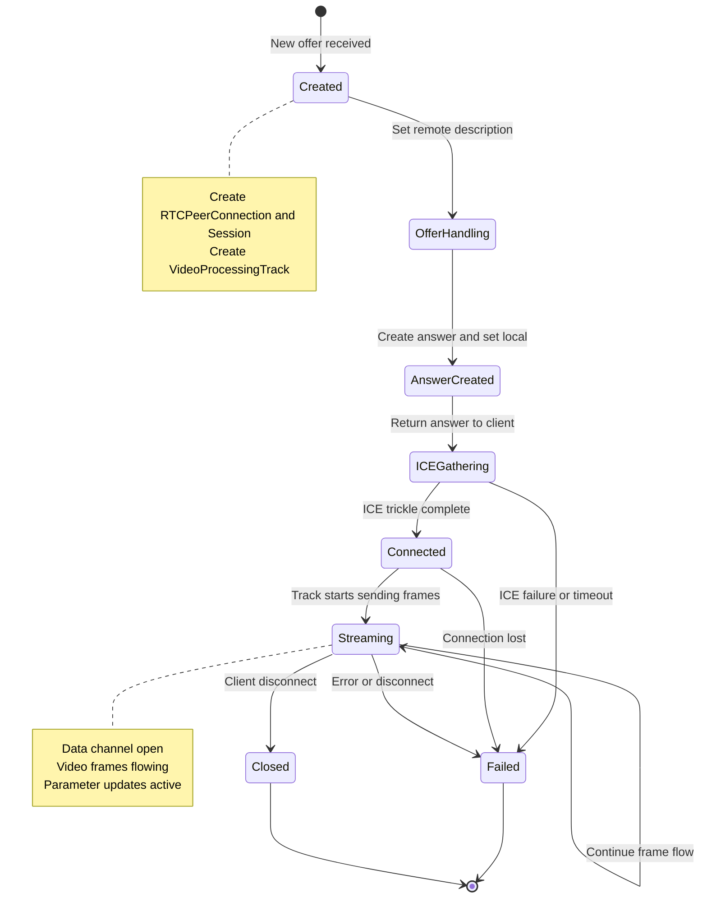

### 9.3. Data Channel Communication

**Purpose**: Bidirectional real-time parameter updates

**Backend → Frontend**:
```json
{
  "type": "stream_stopped",
  "error_message": "CUDA out of memory"
}
```

**Frontend → Backend**:
```json
{
  "prompts": ["a cat", "a dog"],
  "prompt_interpolation_method": "linear",
  "transition": {
    "target_prompts": [...],
    "num_steps": 4
  },
  "denoising_step_list": [1000, 750, 500],
  "noise_scale": 0.5,
  "paused": false
}
```

### 9.4. Notification Sender

**File**: `server/webrtc.py` - `NotificationSender` class

**Purpose**: Thread-safe message sending from backend to frontend

**Key Features**:
- Queue pending messages until data channel ready
- Flush queue on channel open
- Thread-safe scheduling via `call_soon_threadsafe()`

---

## 10. Desktop Application

### 10.1. Electron Main Process

**File**: `app/src/main.ts`

**Key Responsibilities**:
1. **App Lifecycle**: `ready`, `window-all-closed`, `activate`
2. **Window Management**: Create, show, focus windows
3. **Python Process**: Spawn `uv run daydream-scope --port 52178`
4. **IPC Handlers**: Setup state, server status, logs
5. **Auto-updater**: Check, download, install updates

### 10.2. Initialization Flow

```mermaid
flowchart TD
    direction TB
    
    subgraph ElectronInit["Electron App Initialization"]
        
        subgraph CreateWindow["1. Create Main Window"]
            CW1[BrowserWindow create]
            CW2[Configure window properties]
            CW3[Show window]
        end
        
        subgraph CheckSetup["2. Check Setup Required"]
            CS1[Check if .venv exists]
            CS2[Check if uv is installed]
            CS3[Set needsSetup flag]
        end
        
        subgraph SetupOrSkip["3. Setup or Skip"]
            SOS{Setup Required?}
            SOS -->|Yes| RUN[Run Setup]
            SOS -->|No| SKIP[Skip Setup]
            
            RUN --> RUN1[Download and install uv]
            RUN --> RUN2[Run uv sync]
        end
        
        subgraph CheckServer["4. Check Server Status"]
            CSS[HTTP GET /health]
            CSS -->|Already Running| DIRECT[Load Frontend Directly]
            CSS -->|Not Running| START[Start Python Server]
        end
        
        subgraph StartPython["5. Start Python if needed"]
            SP1[Spawn uv run daydream-scope]
            SP2[Wait for health endpoint up to 10 min]
            
            SP2 -->|Success| LOAD[Load Frontend]
            SP2 -->|Timeout| ERROR[Show Error]
        end
        
        subgraph LoadFrontend["6. Load Frontend"]
            LF1[Navigate to http://127.0.0.1:52178]
            LF2[Show streaming UI]
        end
        
        CreateWindow --> CheckSetup --> SetupOrSkip --> CheckServer --> StartPython --> LoadFrontend
    end
```

### 10.3. IPC Communication

**Channels**: `app/src/types/ipc.ts`

**Key Handlers**:
- `GET_SETUP_STATE`: Check if setup needed
- `GET_SETUP_STATUS`: Get setup progress
- `GET_SERVER_STATUS`: Check if backend running
- `SHOW_CONTEXT_MENU`: Show system tray menu
- `GET_LOGS`: Get application logs

**IPC Rate Limiting**:
- Max 100 calls per second per channel
- Max 1000 calls per minute per channel
- Prevents DoS attacks

### 10.4. Security Measures

**File**: `app/src/main.ts`

**Implementations**:
1. **Permission Dialogs**: User consent for all permissions
2. **Navigation Blocking**: Only allow internal URLs
3. **External Link Handling**: Open external URLs in browser
4. **DevTools Monitoring**: Log DevTools access in production
5. **Process Security**: Cleanup on SIGTERM/SIGINT

### 10.5. Auto-Update Flow

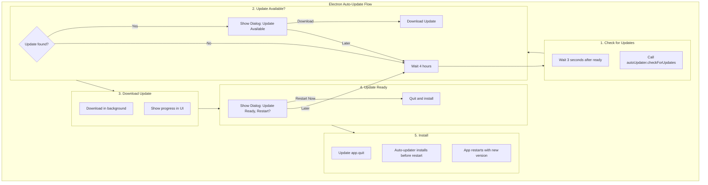

### 10.6. Service Layer

**Location**: `app/src/services/`

**ScopeSetupService**:
- `checkUvInstalled()`: Check if uv is on PATH
- `downloadAndInstallUv()`: Download and install uv
- `runUvSync()`: Run `uv sync` in project directory
- `isSetupNeeded()`: Check if .venv exists

**ScopePythonProcessService**:
- `startServer()`: Spawn Python backend
- `stopServer()`: Kill Python process
- `setServerPort()`: Configure port (default: 52178)

**ScopeElectronAppService**:
- `createMainWindow()`: Create BrowserWindow
- `loadFrontend()`: Navigate to backend URL
- `createTray()`: Create system tray icon
- `sendServerStatus()`: Notify renderer of server state
- `showLogsWindow()`: Create logs viewer window

---

## 11. Additional Topics

### 11.1. Spout Integration

**Purpose**: Windows-only frame sharing with OpenGL applications

**Implementation**: `server/spout/`

- `SpoutSender`: Send frames to Spout-compatible apps (TouchDesigner, OBS)
- `SpoutReceiver`: Receive frames from Spout senders

**Usage**:
```javascript
// Enable via data channel
sendParameterUpdate({
  spout_sender: { enabled: true, name: "MyOutput" },
  spout_receiver: { enabled: true, name: "MyInput" }
});
```

### 11.2. LoRA Support

**Purpose**: Runtime LoRA adapter loading and scaling

**Implementation**:
- `core/pipelines/wan2_1/lora/mixin.py`: `LoRAEnabledPipeline`
- `core/pipelines/wan2_1/lora/strategies/`: Different merge strategies

**Frontend**:
- `LoRAManager.tsx`: LoRA file browser and manager
- `hooks/useLocalSliderValue.ts`: LoRA scale sliders

### 11.3. VACE Support

**Purpose**: Reference image conditioning via VACE module

**Implementation**: `core/pipelines/wan2_1/vace.py`

**Parameters**:
- `ref_images`: List of image paths for conditioning
- `vace_context_scale`: 0.0 to 2.0 scaling factor
- `vace_use_input_video`: Use video frames or ref images

### 11.4. Model Management

**Location**: `server/models_config.py`, `server/download_models.py`

**Features**:
- Automatic download from HuggingFace
- Progress tracking via polling
- Artifact definitions per pipeline
- Multiple model support (diffusion, VAE, text encoder)

### 11.5. Asset Management

**API Endpoints**:
- `GET /api/v1/assets`: List uploaded assets
- `POST /api/v1/assets`: Upload asset (image/video)
- `GET /api/v1/assets/{path}`: Serve asset for thumbnails

**Storage**: `~/.daydream-scope/assets/`

### 11.6. Logging

**Backend**:
- Rotating file logs (5MB per file, 5 backups)
- Log directory: `~/.daydream-scope/logs/`
- Cleanup: Logs older than 1 day deleted

**Frontend**:
- Console logging (browser dev tools)
- Toast notifications via Sonner

**Desktop**:
- Electron log: `electron.log`
- Python process logs streamed to file

### 11.7. Testing

**Backend**: `pytest tests/`
- Unit tests for utilities
- Integration tests for pipelines
- Config validation tests

**Desktop**: `app/src/utils/config.test.ts`
- Config validation tests
- Vitest runner

---

## 12. Summary

Daydream Scope implements a sophisticated multi-tier architecture:

1. **Presentation**: React frontend with hooks-based state
2. **Application**: FastAPI with WebRTC signaling
3. **Domain**: Modular pipeline system with plugins
4. **Infrastructure**: Thread-safe frame processing and streaming

**Key Patterns**:
- Registry pattern for dynamic pipeline discovery
- Schema-first configuration with Pydantic
- Thread-safe state management with reentrant locks
- Component manager for dynamic dependency injection
- Plugin hooks for extensibility

**Data Flow**:
- User input → React hooks → API calls → Backend → Pipeline → FrameProcessor → WebRTC → Video output
- Parameter updates flow through data channels in real-time
- Frames are processed in dedicated worker thread with rate limiting

This architecture enables real-time AI video generation with extensibility, thread safety, and cross-platform support.
